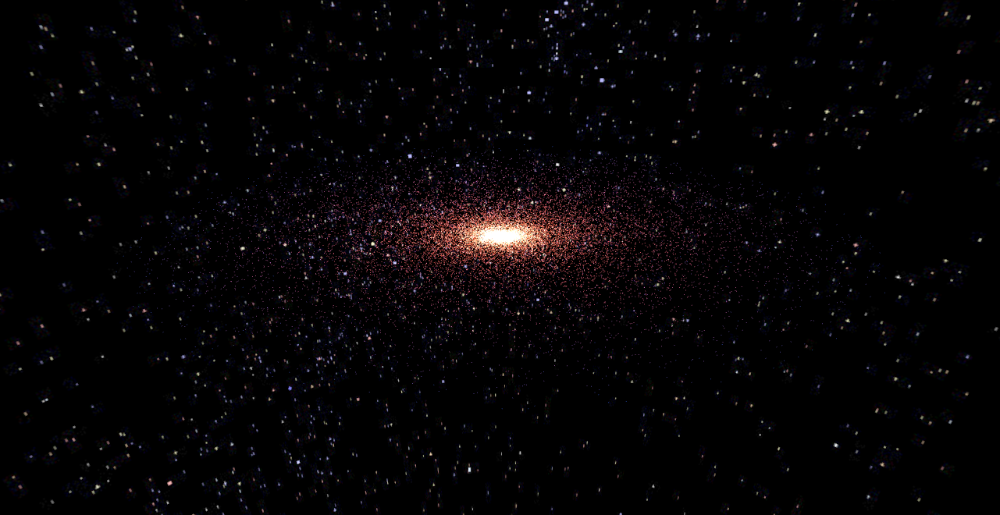

# Particulum - CS460_Final_Project
## By Chase Quigley and Liam Willis

## Description
Particulum is a 3D particle simulator which primarily aims to model various space objects, such as spiral galaxies, elliptical galaxies, and quasars. The simulator also allows the user to 
adjust various parameters to create their own unique galaxy visualizations. This includes galaxy color, type, particle speed, particle size, number of spirals, elliptical galaxy shape, and 
much more!

## Installation
This simulator doesn't require any complex installation. All that is required is a WebGL compatible browser and a link to the site:
* https://lykos3d.github.io/CS460_Final_Project/

## How to - Guide
Upon loading the page, the default elliptical galaxy and parameters will be set. These parameters are able to be configured in the TweakPane menu at the top right of the screen. There are four
different folders:
* General Galaxy Settings: These settings will mostly apply to all particles, regardless of galaxy type. They include:
  * Galaxy type: This menu allows you to select between the different types of galaxies: Spiral, Elliptical, Heartbeat, and Quasar. 
  * Count: This allows you to adjust the number of particles that will load for the galaxy (warning: expensive)!
  * Particle Speed: This will adjust the speed at which the particles will revolve about the center of the galaxy. 
  * Color: This will allow you to change the color of the particles to any specified RGB value.
  * Particle Size: This allows you to change the size of the particles.
* Spiral Galaxy Specifics: These settings will only apply if the Spiral Galaxy is selected:
  * Branches: This changes the number of spiral branches that will form upon galaxy creation. 
  * Radius: This changes the total radius of the spiral galaxy.
* Elliptical Galaxy Specifics: These settings will only apply if the Elliptical Galaxy is selected:
  * Semi Major Axis: This setting allows the user to change the shape of the galaxy by making it "longer."
  * Semi Minor Axis: This setting allows the user to change the shape of the galaxy by making it "wider."
* Quasar: These settings will only apply if the Quasar is selected:
  * Beam Height: This will change the height of the beam shooting vertically from the black hole.

There are also two modes that the user can use to move the particles with the mouse:
* Repulsion Mode: Hold 'e' and hover your mouse to a specific location to have all the particles move away from the cursor.
* Black Hole Mode: Hold 'f' and hover your mouse to a specific location to have all the particles be pulled towards the cursor.

## Visuals 

### Elliptical Galaxy

### Spiral Galaxy

### Quasar

## Challenges 
We encountered many challenges when making this project
* For the elliptical galaxy, calculating the correct values for the semi-major and semi-minor axes proved to be very difficult, and ChatGPT helped immensely for debugging and creating the correct calculations (lines 97-98 in script.js). These two values for a and b were crucial for creating the correct particle updates, and for a while the elliptical galaxy had an odd divot. 
* For the skybox, it initially would delete all the particles upon loading. To fix this, we had to make some render ordering adjustments so that the skybox would load first, allowing the particles to remain.
* The invisible plane also gave us some issues. For example, we were having issues with the raycasting effect, which was giving some inconsistent effects and causing the black hole and repulsion effects to target the wrong location. We fixed this by aligning the invisible plane to be in the same plane as the galaxies, creating the targeted behavior.
* The lagging effect: one of the features we implemented was the lagging effect, which makes it so that particles further from the galactic center move slightly slower than those near the center, creating an interesting visualization. However, this required us to refactor the code such that each particle's position is directly changed after each frame, rather than just rotating the entire mesh with a quaternion. This was very laborious and required quite a lot of mathematics, from applying a rotation matrix for each particle in the case of the spiral galaxy to using parametric equations and the semi-minor and major axes to update the particles for the elliptical galaxy.

## Acknowledgements and References 

### GitHub Tutorial
The Spiral Galaxy was largely built from a tutorial so that we could get the hang of utilizing particles to build galaxies. Much of the code and math was borrowed from the following GitHub repository: https://github.com/PineappleBeer/threejs-journey/tree/master/18-galaxy-generator

### ChatGPT 
ChatGPT was used in various spots in our project to help with mathematics or debugging. Here's a list of locations it was used:
* The resize event listener in script.js was developed with the use of ChatGPT so that the particles would remain consistent when the user resizes their browser window.
* The mathematics in the generateEllipticalGalaxy function (lines 83-100 in galaxy.js) was developed with the help of ChatGPT.
* The spacing factor in line 233 was developed with the help of ChatGPT.
* The repulsionEffect was created with the help of ChatGPT, and the blackHoleEffect is a modification of this function.
* If not mentioned here, any other uses of ChatGPT are indicated in the code.

## Mathematical Equations
We sourced some of the mathematics from these sources.
* Rotation Matrix: https://en.wikipedia.org/wiki/Rotation_matrix
* Ellipse parametric equations: https://www.mathopenref.com/coordparamellipse.html

### CS460 Lectures
We applied knowledge from the CS460 lecture slides. Examples include
1. Picking. This is a technique we learned in assignment 3 where we used an invisible plane in order to project from 2D screen space into the 3D scene.
2. Skybox. This is a technique we learned towards the end of the semester in which we render an image (in our case) to make the user feel like they are within space itself when in reality they are just in the illusion of a 3D environment around them. 
3. Rotation Matrices. A rotation matrix was used on each particle in the spiral galaxy to have them rotate about the world y-axis.

### Stack Overflow
References to stack overflow for specific three.js implementations practices or best practices overall were referred to occasionally. 
* To limit the framerate to be consistent across all screens, we referred to the following Stack Overflow submission: https://stackoverflow.com/questions/11285065/limiting-framerate-in-three-js-to-increase-performance-requestanimationframe

### NASA
The skybox used in this project was sourced from NASA at the following link: https://nasa3d.arc.nasa.gov/detail/yale8

### Other Sources
If any references were missing from above, they are indicated through comments in the source code itself.